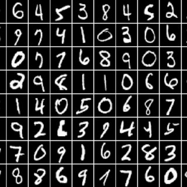
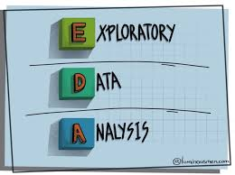
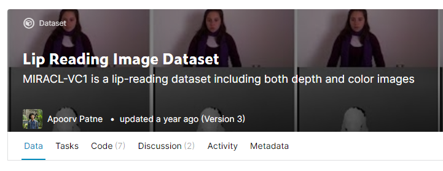
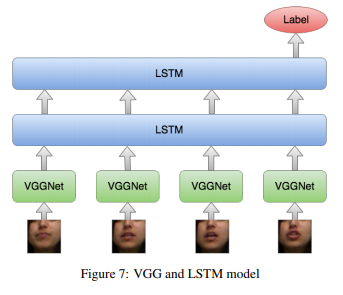
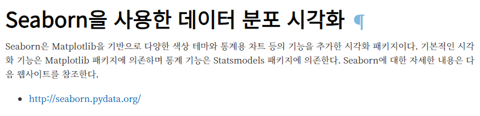

# SIB : simple is best

| Name  | Github Link |
|-------|--------|
| 황현상 | [@hwang-hs](https://github.com/hwang-hs) |
| 윤대헌 | [@Greathoney](https://github.com/Greathoney) |
| 김도훈 | [@yh08037](https://github.com/yh08037) |
| 이주경 | [@leuoo](https://github.com/leuoo) |

## Progress
[Link: Github Teams Discussion](https://github.com/orgs/KNU-BrainAI-Capstone2021/teams/sib/discussions/6)

## Idea
<!--  -->
<!-- <image src="images/1.PNG" width="700">  -->

## MediaPipe Hands

## Data Generation

## Data Preprocessing
### Data Smoothing 
| Original | Gamma Decay | Local Average |
| -------- | ----------- | ------------- |
||||

### 3D Visualization
| Original | Gamma Decay | Local Average |
| -------- | ----------- | ------------- |
||||

## Model Design

## Study
##### Digit Recognizer

##### EDA

##### lib reading-1

##### lib reading-2

##### seaborn

       

